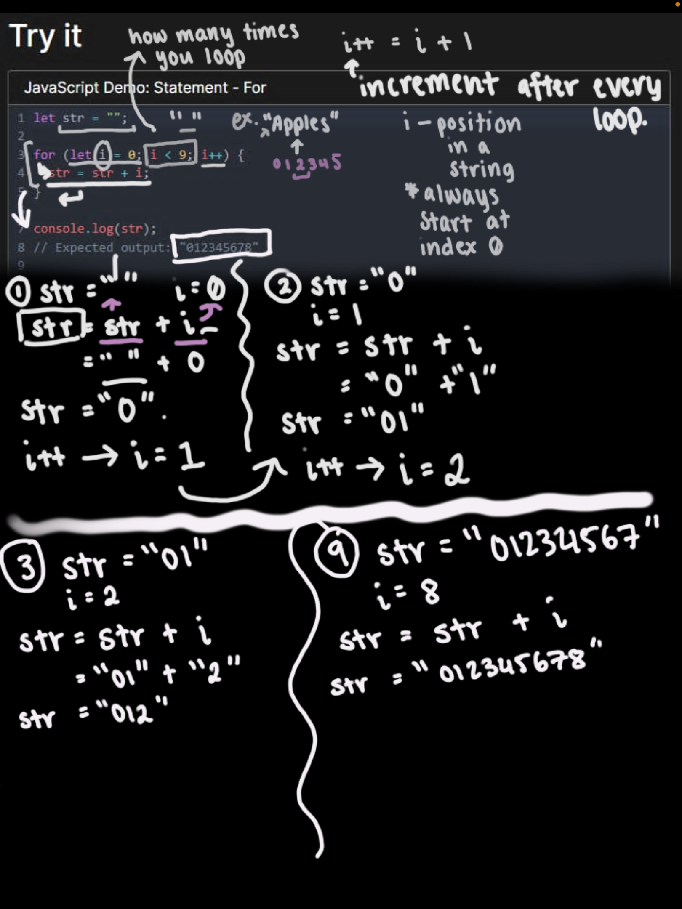

[Read Week 2](/second-week)

[Read Week 3](/third-week)

---
# Homework task 1a

This is my first time touching code, so I find myself struggling to understand anything and becoming overwhelmed with this new language. Upon looking at the homework tasks, I found it jarring to look at all the lines of code for this [sketch](https://editor.p5js.org/capogreco/sketches/-B11g3Uth). So rather than attempting to create the grid, I tried dissecting the code for this sketch through the help of my friend and my little brother who are more experienced in coding.

My friend hopped onto voice chat to explain to me about how the code for the 'For Loop' works and what it is doing. She managed to explain how some strings worked and how the code creates loops.

## Rafael Rozendaal's work: Blocks

I am completely clueless how Rozendaal was able to attain such effect but I'm guessing that he had to code for the colour change of the two rectangles that expand and shrink on screen. The colour change of the background probably have to allign with the two rectangles' frameCount to ensure they change colour at the same time. Then one of the rectangles have to expand whilst the other starts to disappear at a certain point of the canvas.

**list of concepts to replicate the work**

- The drawing function prompting to draw a rectangle/square: rect () or square ()
- To set a range of colours to appear, either using RGB or HSB: Fill ()
- Track the number of frames drawn: frameCount
- possibly using the mode RADIUS instead of CENTER: rectMode (RADIUS).

**List of resources to help learn those concepts**

- The [p5js](https://p5js.org/reference/) website for references
- ChatGPT- to understand concepts of coding
- Tutorials on Youtube eg. The Coding Train

---

# Homework task 1b

First thing I got started on was asking for help in fixing my issue with the 'deno task start' command not working. However, these issues have been fixed and now I am able to publish my blog onto the browser!

---

For this homework task 2, we were tasked to discuss amongst other classmates about the backend code of Rafaël Rozendaal's artworks. The questions that we had to ask eachother included:

- what do you think is going on, under the hood?
- what concepts would I need to understand in order to replicate this work in p5?
- what resources might help me to learn those concepts?

In the Creative Coding discord server, Rania was open to discussing Rozendaal's works so I insisted in having a further discussion. She had selected the artist's piece called <mark>'Missing'</mark> which included tiles of colourful squares and one active square moving at a time.

On the other hand, I picked the piece 'Blocks,' and we proceeded to hypothesize what the code might look like under the hood for each other's artworks. For Rozendaal's "Blocks," Rania assumed that he has used 'a high framecount () variable of around 150 to make the squares move that slowly. Whilst looking at the movement of the squares, she guessed that the artist 'may have utilised frame by frame rendering in draw (), and Position size happens based on time or mathematical functions like sin() for smooth motion.'

**The concepts that she has provided in order to replicate such work included:**

- Rect() and square()
- Fill (), stroke(), color(), and lerpColor().
- Random()
- FrameCount, deltaTime, or time-based functions, sin(), cos(), lerp()
- Using variables (x,y)

---
During this discussion, I found out that Rania had similar resources to me in obtaining information about coding. These common resources comprised of p5.js references, CHATGPT, Youtube channel The Coding Train and W3Schools. However, she had additional sites that I never thought to use such as Stack Overflow and Reddit. This was very insightful and very useful in how I can further develop my learning for coding.

In order to test out my theory, I had to test out some of the concepts that I have listed in the previous homework task. I did not test all of my proposed concepts but I did my best to replicate how the squares expand on screen in the first few frames.I tried to implement code that was easy for me to intepret.

---
## My attempt:

<iframe id="attempt_blocks" src="https://editor.p5js.org/Julie-nguyen5960/full/JVNz4BlQB"></iframe>

I implemented the ColorMode () function to define what colour values I wanted to use. I also used the function rectMode (CENTER) to ensure that the squares' center will expand based on the points (x,y) and the variables 'sizeTop' and 'sizeBottom'.

**Resources I've engaged with:**

- ChatGPT- to obtain functions and strings for specific actions e.g. to make squares expand.
- [JS Operators](https://www.w3schools.com/jsref/jsref_operators.asp)- Provides Javascript Assignment Operators. Useful for incrementing values.
- [HTML Color Modes](https://htmlcolorcodes.com/)- Obtain RGB colour values.
- [P5js References](https://p5js.org/reference/)- Useful for finding different functions and its options.

---
**What I learnt this week:**

1. GitHub and Deno Task Start

I have learnt that GitHub is the platform that stores and manages code whilst the Deno task manager is used to run custom scripts locally. I had trouble working around these unfamiliar platforms so I'm still learning!

2. Coding in P5.js

We did some class activities where Thomas would write up some code in a p5.js sketch and had to discuss amongst our colleagues on what this newly inserted code would do. I was able to learn how to colour the background of the canvas, create a square and other simple functions. Hopefully, my knowledge will progress from here!